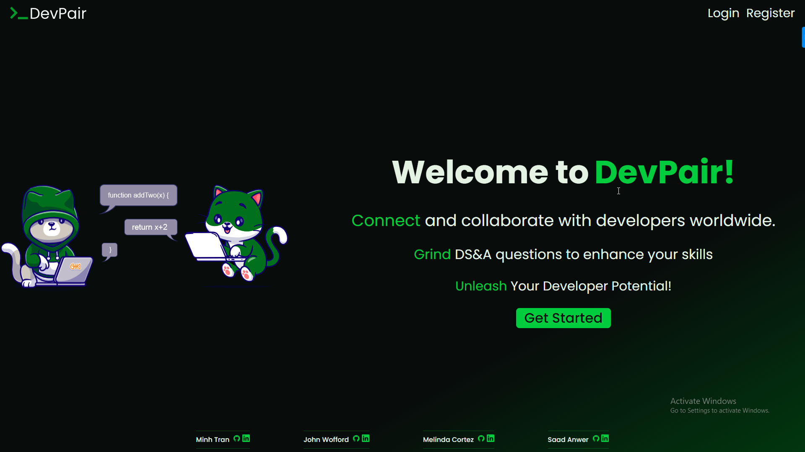
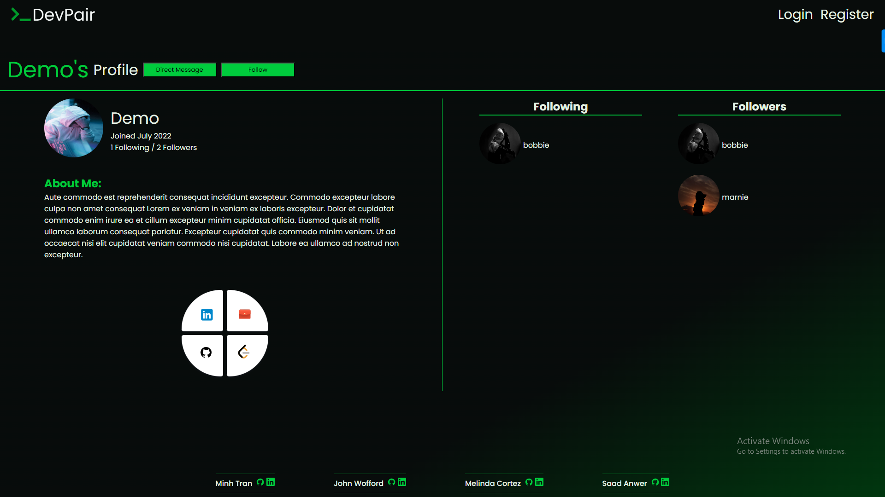
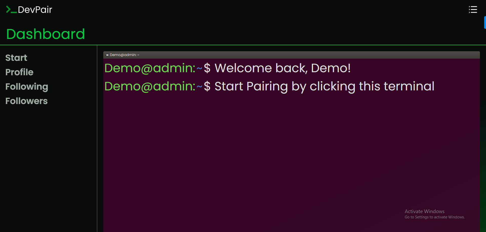
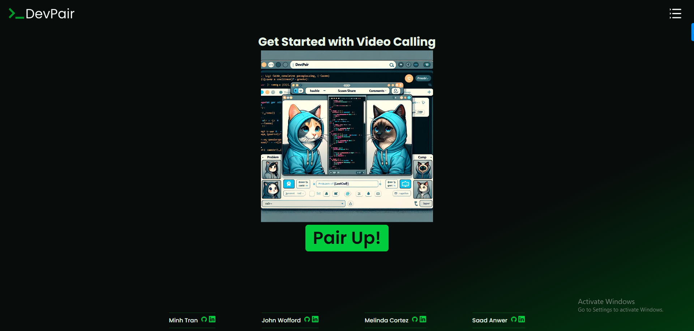
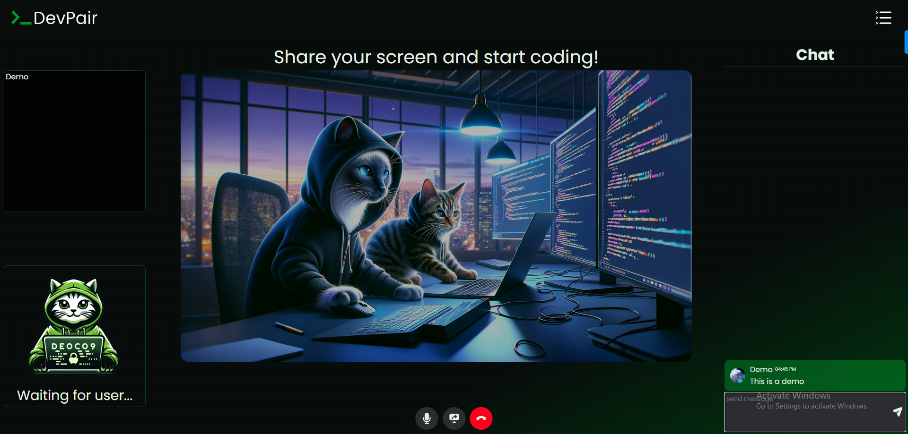

# $${\color{blue}G}{\color{red}o}{\color{yellow}o}{\color{blue}g}{\color{green}l}{\color{red}e}\space AI \space Hackathon \space DevPair$$
<!-- FORMAT FOR THIS STYLING: $${\color{red}Welcome \space \color{lightblue}To \space \color{orange}Stackoverflow}$$ -->
$${\color{red}by \space \color{lightblue}Minh, \space \color{lightblue}Melinda, \space \color{lightblue}Sebastian}$$

# The Official DevPair Repository
- ### This is where we'll be constantly updating this project to its full potential.

# About
- **Accessibility-Focused with Gemini AI**: Enhances user pairing for Data Structures & Algorithms practice by introducing personalized LeetCode problems and automatic solution testing through Gemini AI.

- **Random Pairing with Learning Boost**: Connects users randomly while Gemini AI provides custom coding challenges and instant feedback, fostering a practical learning environment.

- **Interactive Platform with Smart Features**: Offers video and chat for collaboration, enriched with Gemini AI's problem generation and solution validation, making learning interactive and efficient.

- **Community-Driven with AI Support**: Builds a supportive environment for finding programming partners, with Gemini AI adding a layer of educational content suitable for all skill levels.

- **Flexible Pairing with Intelligent Enhancement**: Allows choice in pairing, while Gemini AI tailors challenges and feedback to the pair’s skill set, ensuring a progressive learning journey.

# Current Features (MVPs)
1. Video Calling
2. Chatting
3. Screen Sharing
4. Gemini AI
5. IDE DS&A Tests
6. User Friends

### Features Coming Soon
1. User Direct Messaging
2. User Statistics

# Technology

### Front-end Technologies:
- React: A JavaScript library for creating dynamic user interfaces, essential for front-end web application development.
- Redux & @reduxjs/toolkit: Tools for managing and centralizing application state, commonly used with React to facilitate state management in complex applications.
- TypeScript: A statically typed superset of JavaScript that introduces type safety and is often used to develop robust front-end and back-end applications.
### Back-end Technologies:
- Python: A high-level, versatile programming language for server-side logic, serving as the backbone for many web applications.
- Flask: A minimalist web framework for Python, providing the flexibility to build web applications quickly and with minimal setup.
- Flask-SocketIO: An extension for Flask that enables WebSocket support, facilitating real-time, bidirectional communication between the web client and server.
### Database Management:
- PostgreSQL: A powerful, open-source object-relational database system used in production for its advanced features and reliability.
- SQLite: A lightweight, file-based database, ideal for development and testing environments due to its simplicity and ease of use.
- SQLAlchemy: An ORM and SQL toolkit for Python, providing a full range of patterns for database access and manipulation.
### Real-time Communication:
- Agora-RTC: A technology enhancing WebRTC with additional features for high-quality real-time voice and video communication, crucial for applications requiring live interaction.
### AI and Machine Learning:
- Google AI Gemini API: A cutting-edge API from Google AI, designed to provide advanced artificial intelligence and machine learning capabilities. This could include anything from natural language processing, image recognition, to predictive analytics, significantly enriching the application's features and user experience.

# Project Demo
- Updated Demo Showcase Coming Soon..
<!--





-->

<!-- 


 -->
<br>
<br>


# Getting Started

### Prereq:

- Agora-RTC
    1. Signup for [Agora-RTC](https://sso2.agora.io/en/v6/signup)
    2. Grab the `App ID`
    3. Grab the `App Certificate`
    4. Generate a temp `RTC Token`

- Gemini AI
    1. Grab the API key in Google AI Studio to utilize [GeminiAI](https://ai.google.dev/)

- Amazon Web Services S3
    1. Setup an [AWS Account](https://aws.amazon.com/)
    2. Setup a `bucket`
    3. Grab the AWS `Key` and `Secret`

## Method 1: Use setup.sh script
- Run the install script in the terminal
    - `sh setup.sh`
        - This script will create a `.env` with necessary variables and values for the user to initialize the project and install all dependencies on the client and server.
- Terminal 1:
    - `cd into client`
    - In `.env`, set AppId, App Certificate, RTC Token.
    - `npm run dev`
- Terminal 2:
    - `cd into server`
    - In `.env`, set AWS S3 and Gemini API Key.
    - `pipenv shell`
    - `flask run`

## Method 2: Manual

### /server
- `cd` into the `server` folder
- Create a `.env` file with a key
    - `SECRET_KEY=<secret key>`
    - `DATABASE_URL=sqlite:///dev.db`
    - `SCHEMA=<schema_name>`
- `pipenv install -r requirements.txt`
- `pipenv shell`
- `flask db migrate`
- `flask db upgrade`
- `flask seed all`
- `flask run`

### /client
- `cd` into the `client` folder
- Create a `.env` file and input the proper values. Refer to `.env.example`
- `npm i`
- `npm run build` in one terminal for typescript
- `npm run dev` in another terminal

# Enhancements / Prettier Settings
- `cd` into the `client` folder
- Create a `.prettierrc` file
- Recommended settings that offer an ideal balance for code readability and style:
    ```
    {
        "printWidth": 120,
        "tabWidth": 4,
        "singleQuote": true,
        "trailingComma": "es5",
        "bracketSpacing": true
    }
    ```
- It's important to note, however, that these settings are based on personal preference and might not be universally preferred. Adjustments can be made according to individual or team standards to better suit different coding styles or project requirements.

# Deployment

### Build Command
- `./build.sh`
- Inside build.sh
    ```
    #!/bin/bash

    # Stop the script if any command fails
    set -e

    # Navigate to the client directory and run npm commands
    echo "Installing client dependencies and building the client..."
    cd client
    npm install
    npm run start
    cd ..

    # Navigate to the server directory and run pip commands
    echo "Installing server dependencies and setting up the database..."
    cd server
    pip install -r requirements.txt
    pip install psycopg2
    flask db upgrade
    flask seed all
    cd ..

    echo "Build and setup completed successfully!"
    ```

### Start Command
- `cd server && gunicorn -k gevent -w 1 app:app`

### Versions File
```
from alembic import op
import sqlalchemy as sa
import os
environment = os.getenv("FLASK_ENV")
SCHEMA = os.environ.get("SCHEMA")

if environment == "production":
        op.execute(f"ALTER TABLE users SET SCHEMA {SCHEMA};")
        op.execute(f"ALTER TABLE chatrooms SET SCHEMA {SCHEMA};")
        op.execute(f"ALTER TABLE direct_messages SET SCHEMA {SCHEMA};")
        op.execute(f"ALTER TABLE friend_requests SET SCHEMA {SCHEMA};")
        op.execute(f"ALTER TABLE friends_association SET SCHEMA {SCHEMA};")
        op.execute(f"ALTER TABLE messages SET SCHEMA {SCHEMA};")
```

### env.py
```
from __future__ import with_statement

import logging
from logging.config import fileConfig

from sqlalchemy import engine_from_config
from sqlalchemy import pool

from alembic import context

import os
environment = os.getenv("FLASK_ENV")
SCHEMA = os.environ.get("SCHEMA")


# this is the Alembic Config object, which provides
# access to the values within the .ini file in use.
config = context.config

# Interpret the config file for Python logging.
# This line sets up loggers basically.
fileConfig(config.config_file_name)
logger = logging.getLogger('alembic.env')

# add your model's MetaData object here
# for 'autogenerate' support
# from myapp import mymodel
# target_metadata = mymodel.Base.metadata
from flask import current_app
config.set_main_option(
    'sqlalchemy.url',
    str(current_app.extensions['migrate'].db.engine.url).replace('%', '%%'))
target_metadata = current_app.extensions['migrate'].db.metadata

# other values from the config, defined by the needs of env.py,
# can be acquired:
# my_important_option = config.get_main_option("my_important_option")
# ... etc.


def run_migrations_offline():
    """Run migrations in 'offline' mode.
    This configures the context with just a URL
    and not an Engine, though an Engine is acceptable
    here as well.  By skipping the Engine creation
    we don't even need a DBAPI to be available.
    Calls to context.execute() here emit the given string to the
    script output.
    """
    url = config.get_main_option("sqlalchemy.url")
    context.configure(
        url=url, target_metadata=target_metadata, literal_binds=True
    )

    with context.begin_transaction():
        context.run_migrations()


def run_migrations_online():
    """Run migrations in 'online' mode.
    In this scenario we need to create an Engine
    and associate a connection with the context.
    """

    # this callback is used to prevent an auto-migration from being generated
    # when there are no changes to the schema
    # reference: http://alembic.zzzcomputing.com/en/latest/cookbook.html
    def process_revision_directives(context, revision, directives):
        if getattr(config.cmd_opts, 'autogenerate', False):
            script = directives[0]
            if script.upgrade_ops.is_empty():
                directives[:] = []
                logger.info('No changes in schema detected.')

    connectable = engine_from_config(
        config.get_section(config.config_ini_section),
        prefix='sqlalchemy.',
        poolclass=pool.NullPool,
    )

    with connectable.connect() as connection:
        context.configure(
            connection=connection,
            target_metadata=target_metadata,
            process_revision_directives=process_revision_directives,
            **current_app.extensions['migrate'].configure_args
        )
        # Create a schema (only in production)
        if environment == "production":
            connection.execute(f"CREATE SCHEMA IF NOT EXISTS {SCHEMA}")

        # Set search path to your schema (only in production)
        with context.begin_transaction():
            if environment == "production":
                context.execute(f"SET search_path TO {SCHEMA}")
            context.run_migrations()

if context.is_offline_mode():
    run_migrations_offline()
else:
    run_migrations_online()
```
